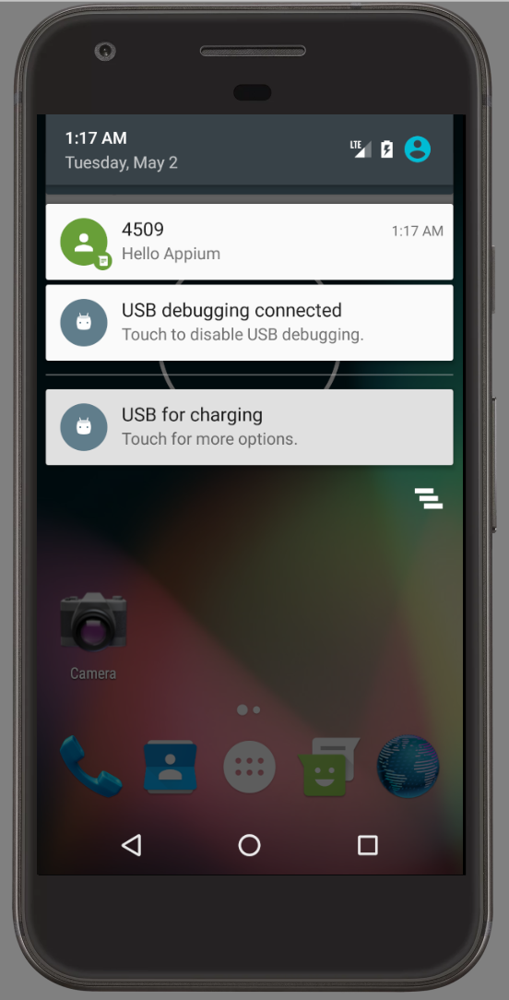

# Usage

# getAdbVersion

```javascript
await adb.getAdbVersion();
```

```json
{
  "versionString": "1.0.39",
  "versionFloat": 1,
  "major": 1,
  "minor": 0,
  "patch": 39
}
```

# powerAC

```javascript
let state = 'off';
await adb.powerAC(state);
```
Possible values:
 * on
 * off

# powerCapacity
```javascript
let batteryPercent = 50;
await adb.powerCapacity(batteryPercent);
```

# powerOFF
```javascript
await adb.powerOFF();
```

# gsmCall
```javascript
let action = 'call';
let phoneNumber = 4509;
await adb.gsmCall(phoneNumber, action);
```

Possible values:
 * call
 * accept
 * hold
 * cancel

# gsmSignal
```javascript
let signalStrengh = 0;
await adb.gsmSignal(signalStrengh);
```
Possible values: 0..4

# gsmVoice
```javascript
let state = 'roaming';
await adb.gsmVoice(state);
```

Possible values:

 * unregistered
 * home
 * roaming
 * searching
 * denied
 * off (unregistered alias)
 * on (home alias)

# sendSMS

```javascript
let phoneNumber = 4509;
let message = "Hello Appium"
await adb.sendSMS(phoneNumber, message);
```

<details>
  <summary></summary>
  
</details>

# rotate

```javascript
await adb.rotate();
```

# root

```javascript
await adb.root();
```

# unroot

```javascript
await adb.unroot();
```
